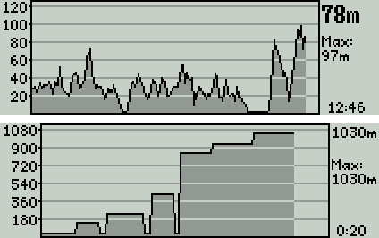
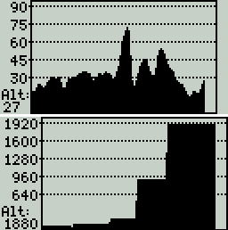
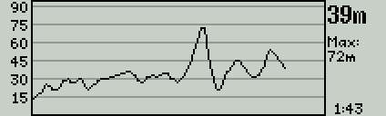
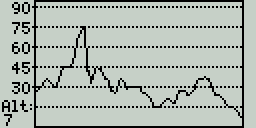
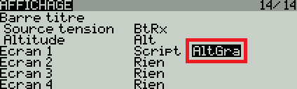

# AltGra
Altitude Graphique - Script LUA conçu pour OpenTX 2.2 ou supérieur

Ce script permet d'afficher l'altitude de façon graphique.
Même si le graphique n'est pas affiché à l'écran, les altitudes sont enregistrées dès que les conditions de démarrage sont réunies.

Fonctionnalités principales:
 * L'axe du temps se compresse au fur et à mesure. Ainsi on peut voir toute la séance de vol.
 * Le script se remet à zéro après un appui long sur le bouton **ENT** et en choisissant réinitialisation télémétrie.
 * Si l’altitude dépasse les 1000m (punaise, vous avez de bons yeux), alors l'écran se modifie afin d'afficher tout correctement (voir les captures d'écran ci-dessous).
 * Sur les X9, les minutes et secondes de l'axe du temps sont affichées en bas à droite.

Radios de type X9 |  Radios de type X7/X-Lite
------------------|--------------------------
 | 

**Important:** ce script ne gère pas les altitudes négatives. Elles sont forcées à 0m.

Voici les variables à modifier afin de personnaliser le fonctionnement du script:
```
local nomVario = "Alt"      -- Nom de votre capteur d'altitude (il est défini dans votre page télémétrie)
local altStart = 3          -- Démarre l'enregistrement si l'altitude est supérieure (valeur en mètre)
local altStartMode = "Auto" -- Si "Auto" alors 'altStart' est utilisé, sinon choisir un inter 3 positions (par ex: "sb")
local graphPlein = true     -- Il faut choisir "true" ou "false": true va afficher le graphique en plein
```
* Si besoin, il faut modifier le nom du capteur (le nom est visible dans la page télémétrie). Le nom par défaut est `Alt`.
* En mode automatique (`altStartMode = "Auto"`), le script démarre automatiquement lorsque l'altitude dépasse `3`m (variable `altStart`).
Le graphique se remet à zéro après un appui long sur le bouton **ENT** et en choisissant **réinitialisation télémétrie**.
* En mode manuel, il faut choisir un interrupteur à 3 positions. Exemple avec l'inter **SE** → `altStartMode = "se"`. Dans ce mode, la variable `altStart` n'est plus utilisée.
  * SE↑ = Graphique en pause
  * SE- = Graphique en fonctionnement
  * SE↓ = Remise à zéro
* Si vous ne souhaitez pas que les graphiques soient pleins, alors il faut mettre la variable `graphPlein` sur `false`.


Voilà ce qui est affiché si vous régler `graphPlein = false`

Radios de type X9 |  Radios de type X7/X-Lite
------------------|--------------------------
 | 

Le script doit être copié sur la carte SD dans le dossier suivant:
**\SCRIPTS\TELEMETRY**

Puis il faut l'activer:



Si le coeur vous en dit:

